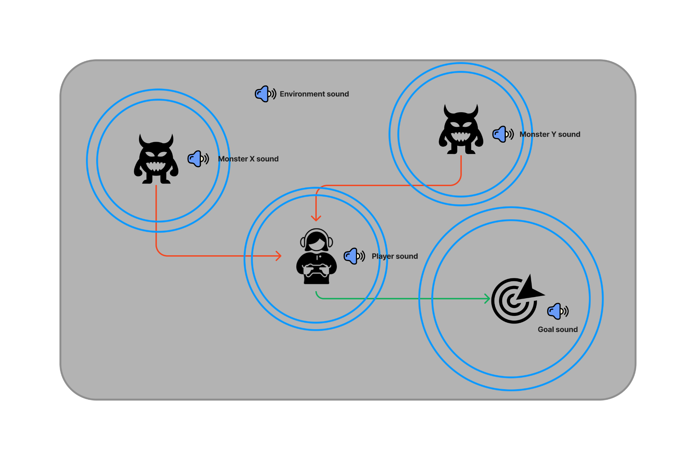
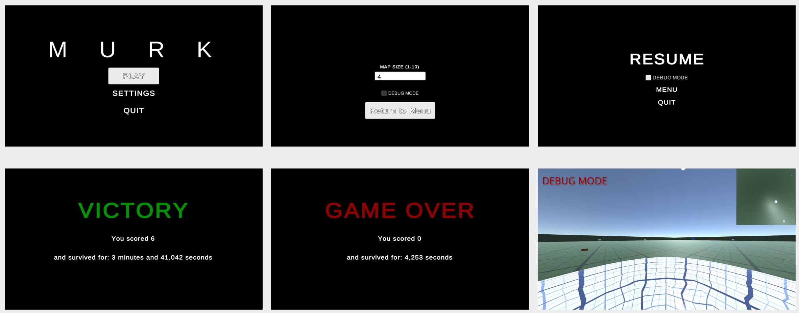
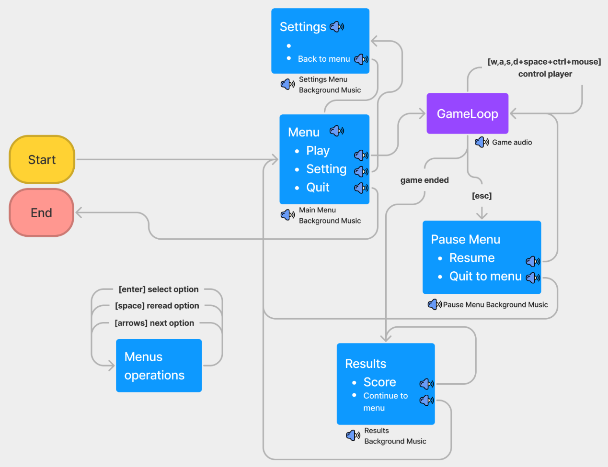

# :skull: :headphones: murk

Games usually have graphics and sound. However, as the visual is usually preferred, it ends up not taking advantage of resources that an audio-only game could offer.
Murk's idea is to be an immersive game by listening, where there are no graphics, just sounds. The user will put on headphones, close his eyes and concentrate to understand where he is and what elements are around him.
Game's main goal: turn off radios across the map by surviving the monsters.

This project was developed for the Human-Computer Interaction course at [INF](https://inf.ufrgs.br)-[UFRGS](https://ufrgs.br).

## Authors
- [Henrique Borges](https://github.com/HenriqueBMa)
- [Gabriel Madeira](http://gabrielmadeira.com)
